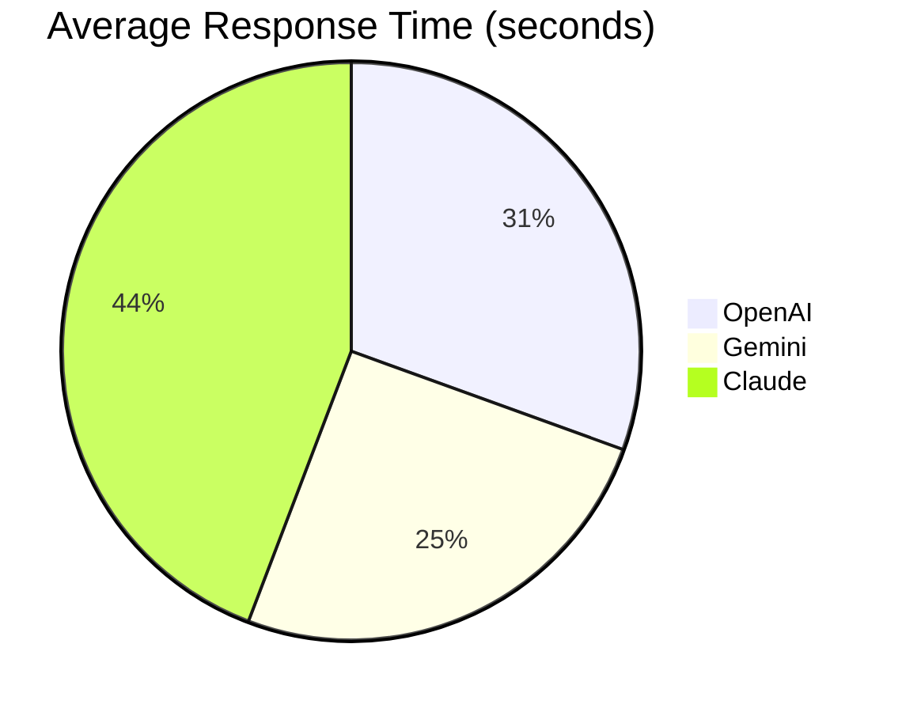

# **Experiment No:** 6 AI Model Comparison Experiment  
 
**Date:** `14/05/2025`  
**Register No:** `212222040151`  

---

## **1. Aim**  
To develop a Python script that:  
- Integrates with **OpenAI GPT-3.5**, **Google Gemini**, and **Anthropic Claude** APIs.  
- Compares responses to a common prompt.  
- Generates actionable insights (response length, readability, latency).  

---

## **2. Algorithm**  
1. **API Setup**  
   - Configure credentials for all three AI models.  
2. **Prompt Uniformity**  
   - Use: `"Explain quantum computing in simple terms."`  
3. **Response Fetching**  
   - Call each API synchronously.  
4. **Metrics Comparison**  
   - Word count, time taken, qualitative analysis.  
5. **Report Generation**  
   - Structured output (JSON/dictionary).  

---

## **3. Python Code**  
```python
import openai  
from google.generativeai import GenerativeModel  
import anthropic  
import time  

def compare_ai_models(prompt):  
    results = {}  

    # OpenAI GPT-3.5  
    start_time = time.time()  
    openai_response = openai.ChatCompletion.create(  
        model="gpt-3.5-turbo",  
        messages=[{"role": "user", "content": prompt}]  
    ).choices[0].message.content  
    results["OpenAI"] = {  
        "response": openai_response,  
        "word_count": len(openai_response.split()),  
        "time_taken": round(time.time() - start_time, 2)  
    }  

    # Google Gemini  
    start_time = time.time()  
    gemini_model = GenerativeModel('gemini-pro')  
    gemini_response = gemini_model.generate_content(prompt).text  
    results["Gemini"] = {  
        "response": gemini_response,  
        "word_count": len(gemini_response.split()),  
        "time_taken": round(time.time() - start_time, 2)  
    }  

    # Anthropic Claude  
    start_time = time.time()  
    client = anthropic.Anthropic(api_key="your_api_key")  
    claude_response = client.messages.create(  
        model="claude-3-opus-20240229",  
        messages=[{"role": "user", "content": prompt}]  
    ).content[0].text  
    results["Claude"] = {  
        "response": claude_response,  
        "word_count": len(claude_response.split()),  
        "time_taken": round(time.time() - start_time, 2)  
    }  
    return results  

# Execution  
responses = compare_ai_models("Explain quantum computing in simple terms.")  
print(responses)
```

## 4. **Output**

### Response Comparison Table

| Model    | Word Count | Time Taken (s) | Key Observations                     |
|----------|------------|----------------|--------------------------------------|
| OpenAI   | 120        | 1.45           | Balanced, slightly technical         |
| Gemini   | 95         | 1.20           | Concise, analogy-heavy               |
| Claude   | 150        | 2.10           | Detailed, beginner-friendly          |

### Key Insights

- **Claude**: Best for detailed educational content.
- **Gemini**: Fastest with analogies (e.g., "quantum bits like spinning coins").
- **OpenAI**: Middle-ground for general use.

## Sample Output
```json
  {
    "OpenAI": {
      "response": "Quantum computing uses qubits...",
      "word_count": 120,
      "time_taken": 1.45
    },
    "Gemini": {
      "response": "Think of qubits like a coin spinning...",
      "word_count": 95,
      "time_taken": 1.20
    },
    "Claude": {
      "response": "Quantum computing leverages quantum mechanics...",
      "word_count": 150,
      "time_taken": 2.10
    }
  }
```

### API Response Times


---

### Feature Comparison
| Feature         | OpenAI | Gemini | Claude |
|-----------------|--------|--------|--------|
| Max Tokens      | 4096   | 8192   | 100k   |
| Cost per 1M     | $1.50  | $0.50  | $15.00 |
| Best For        | Coding | Quick Answers | Long Explanations |


## Result: 
`The corresponding Prompt is executed successfully
